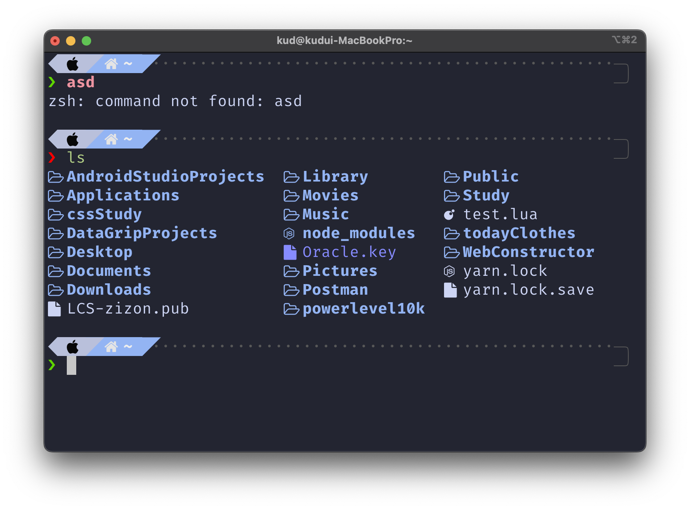

# My-Terminal


- 해당 레포지토리는 `mac`, `linux`, `windows`에서 터미널 환경을 사용할때마다 번거로움을 느껴 설정 커맨드를 저장하고자 하는 레포지토리입니다.

- Windows
   

- Mac
    

## Mac,Linux

- `mac`은 기본적으로 `brew`가 필요합니다.

```bash
/bin/bash -c "$(curl -fsSL https://raw.githubusercontent.com/Homebrew/install/HEAD/install.sh)"
```

   

- 'brew'가 설치 되었다면 `mac`에서 다양한 기능을 가진 터미널 `Iterm2`를 설치해보도록 하겠습니다.


```bash
Iterm2

brew install --cask iterm2

```
   
   - 왼쪽 `iterm` 오른쪽 `Terminal`   

- 저는 `bash` 보다 `zsh`환경을 선호하는 편이기 때문에 `zsh`도 설치하겠습니다.   

```bash
# curl 사용하여 zsh 설치
sh -c "$(curl -fsSL https://raw.githubusercontent.com/ohmyzsh/ohmyzsh/master/tools/install.sh)"
```
   

```bash
# zsh 플러그인 Auto Suggestions
brew install zsh-autosuggestions

# Auto Suggestions 세팅
echo "source /usr/local/share/zsh-autosuggestions/zsh-autosuggestions.zsh" >> ~/.zshrc

# zsh플러그인 Syntax Highlighting
git clone https://github.com/zsh-users/zsh-syntax-highlighting.git ${ZSH_CUSTOM:-~/.oh-my-zsh/custom}/plugins/zsh-syntax-highlighting

# Syntax Highlighting 세팅
echo "source ~/.oh-my-zsh/custom/plugins/zsh-syntax-highlighting/zsh-syntax-highlighting.zsh" >> ${HOME}/.zshrc

# zsh 테마 Powerlever10k 설치
git clone --depth=1 https://github.com/romkatv/powerlevel10k.git ${ZSH_CUSTOM:-$HOME/.oh-my-zsh/custom}/themes/powerlevel10k

```
| zsh-autosuggestions | zsh-syntax-highlighting | 
|-------------- | -------------- | 
| ||


- 해당 설치 과정을 수행하고 나고 `zsh`를 타이핑 하면 `powerlevel10k`의 세팅 화면이 시작 될것입니다.

> Powerlever10k는 `Nerd Font`가 없으면 아이콘이 깨지게 되기 때문에 저는 `Fira Code Nerd Font`를 설치해서 사용했습니다  
>
> [Nerd Font](https://www.nerdfonts.com/font-downloads) 

- 마지막으로 `IDE Neovim`과 `Github TUI Tool lazygit`을 설치하면 끝입니다.  

```bash
# neovim 설치
brew install neovim

# neovim 커스텀 세팅
git clone https://github.com/kimud6003/NvChad ~/.config/nvim; nvim

# lazygit 설치
brew install lazygit
```
   
   - vim vs Neovim

   
   - lazygit

## Window

- `Window`의 경우 저는 `wsl2`를 사용하여 개발을 주로합니다.

- 하지만 `Window`에서 개발이 필요하다고 생각 드는 경우에 아래 세팅을 하는데 참고 해주시면 좋겠습니다.

> `wsl2`가 궁금하시다면 [wsl2](https://github.com/kimud6003/wsl) 

- 우선 윈도우에서는 패키지 관리자로 `chocolatey`가 필요합니다. 

- `chocolatey`는 `powerShell` 을 관리자 권한으로 실행후 아래 코드를 치면 설치가 가능합니다.

```bash
Set-ExecutionPolicy Bypass -Scope Process -Force; [System.Net.ServicePointManager]::SecurityProtocol = [System.Net.ServicePointManager]::SecurityProtocol -bor 3072; iex ((New-Object System.Net.WebClient).DownloadString('https://chocolatey.org/install.ps1'))

choco feature enable -n allowGlobalConfirmation
```

   

- 아마 여러분들의 `powerShell`은 저처럼 색이 어둡지 않고 파란색일 겁니다. 

- 이와 같은 설정도 앞으로 차차 해보도록 하겠습니다.

- `powerShell`보다 높은 `Terminal`을 설치해서 기존의 `shell` 보다 다양한 환경을 구성해보도록 하겠습니다 

- 설치 방법은 크게 2가지로 하나는 `microsoft Store`를 사용하는 방법과 , `chocolatey`를 사용하는 방법이 있습니다.  

- 방법 1
   | microsoft store | 터미널 검색 | 
   |-------------- | -------------- | 
   | ||

- 방법 2

   ```bash
      install microsoft-windows-terminal
   ``` 

- 그럼 이제 `Terminal`설치가 완료가 되었습니다.

- 이제 `powerShell` 최신 버전을 설치해보도록 하겠습니다. (2022-7월 기준으로 7.2.5버전이 최신입니다)

   ```bash
      install powershell-core
   ``` 
   

- `powerShell`도 현재 `bash`처럼 밋밋한 느낌으로 되어있습니다.

- 이것을 `zsh`처럼 바꾸어 보도록 하겠습니다.

```bash
# oh-my-zsh와 비슷한 Tool install
Install-Module oh-my-posh -Scope CurrentUser

# oh-my-posh git Tool install
Install-Module posh-git -Scope CurrentUser

# Pretty ls Install
Install-Module -Name PowerColorLS -Repository PSGallery

# oh-my-posh update
Update-Module -Name oh-my-posh -AllowPrerelease -Scope CurrentUser

# zsh-autosuggestions 기능하는 Tool
Import-Module PSReadLine
Set-PSReadLineOption -PredictionSource History

# .zshrc의 powershell 버전인 profile파일 만들기
New-Item -ItemType File -Path $PROFILE

# poshTheme 설치
Get-PoshThemes

# posh 실행
Set-PoshPrompt -Theme M365Princess
```

- 이제 설치가 끝났으니 설정을 하나 해주도록 하겠습니다.

- `$PSHOME\Microsoft.PowerShell_profile.ps1` 파일을 열어 아래 코드를 넣어주면 됩니다.

```bash
Import-Module PSReadLine
Import-Module PowerColorLS
Set-PoshPrompt -Theme M365Princesss
Set-PSReadLineOption -PredictionSource History
Set-Alias -Name ls -Value PowerColorLS -Option AllScope
```


